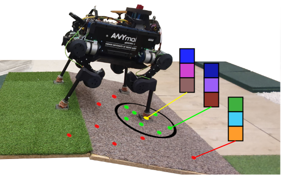

# 🤖 Signal Transformer

<div align="center">
  
  
  [](https://arxiv.org/pdf/2209.15135)
  [](https://pages.mini.pw.edu.pl/~estatic/pliki/PP-RAI_2024_proceedings.pdf#page=357)
</div>

---

## 📖 Overview

**Signal Transformer** is a transformer-based model designed for generating efficient force/torque signal representations for haptic localization of legged robots.

## 🏗️ Architecture

<div align="center">
  
  <p><em>Signal Transformer Model Architecture</em></p>
</div>

---

## 📚 Publications

This model has been used in the following research papers:

- Sójka, Damian, Michał R. Nowicki, and Piotr Skrzypczyński. **"Learning an Efficient Terrain Representation for Haptic Localization of a Legged Robot."** 2023 IEEE International Conference on Robotics and Automation (ICRA). IEEE, 2023. 📄 [Read Paper](https://arxiv.org/pdf/2209.15135)
- Sójka, Damian, Michał R. Nowicki, and Piotr Skrzypczyński. **"Triplet loss-based metric learning for haptic-only robot localization."** Progress in Polish Artificial Intelligence Research 5: Proceedings of the 5th Polish Conference on Artificial Intelligence (PP-RAI'2024), 2024. 📄 [Read Paper](https://pages.mini.pw.edu.pl/~estatic/pliki/PP-RAI_2024_proceedings.pdf#page=357)

---

## 📄 Citation

If you use this work in your research, please cite our papers:

### ICRA 2023
```bibtex
@inproceedings{sojka2023learning,
  title={Learning an Efficient Terrain Representation for Haptic Localization of a Legged Robot},
  author={S{\'o}jka, Damian and Nowicki, Micha{\l} R and Skrzypczy{\'n}ski, Piotr},
  booktitle={2023 IEEE International Conference on Robotics and Automation (ICRA)},
  pages={12170--12176},
  year={2023},
  organization={IEEE}
}
```

### PP-RAI 2024
```bibtex
@INBOOK{Sójka2024:i58561,
    author="{Sójka, Damian and Nowicki, Michał R. and Skrzypczyński, Piotr}",
    title="{Triplet loss-based metric learning for haptic-only robot localization}",
    year="2024",
    type="chapter in monograph / paper",
    language="en",
    booktitle="{Progress in Polish Artificial Intelligence Research 5 : Proceedings of the 5th Polish Conference on Artificial Intelligence (PP-RAI'2024), 18-20.04.2024, Warsaw, Poland}",
    publisher="{Politechnika Warszawska}",
    pages="338--345",
    url="https://pages.mini.pw.edu.pl/~estatic/pliki/PP-RAI_2024_proceedings.pdf#page=357"
}
```

---

## 🙏 Acknowledgments

I would like to thank the following contributors and resources:

- **Jakub Bednarek** - [putpy_tf package](https://github.com/jbed94)
- **TensorFlow Triplet Loss** - [Implementation reference](https://github.com/omoindrot/tensorflow-triplet-loss)
