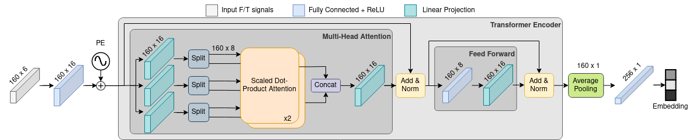

# Signal Transformer
Transformer-based model for generating an efficient force/torque signal representations for haptic localization of a legged robot.

## Architecture

## Credits:
- mgr inż. Jakub Bednarek's https://github.com/jbed94  package - putpy_tf
- https://github.com/omoindrot/tensorflow-triplet-loss